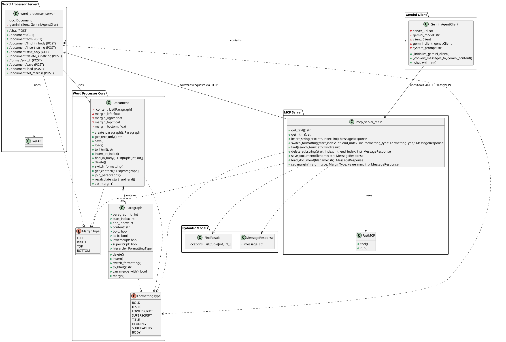

# LLM First Word Editor

This project is a web-based word processor that is controlled by a Large Language Model (LLM) through a tool-based interface. The user can interact with the word processor by giving commands to a Gemini-based agent in natural language through a chat interface.

## Features

- Create and modify documents using natural language commands in a chat window.
- Format text with **bold**, *italic*, subscript, superscript, and different heading styles.
- Set document margins (left, right, top, bottom).
- Find and replace text.
- Save and load documents.
- Live rendering of the document in a web browser.

## Project Structure

```
├── .gitignore
├── class_diagram.puml
├── logfile.txt
├── mcp_server_main.py
├── paragraph_log.txt
├── README.md
├── starte_server_gemini.cmd
├── word_processor_server.py
├── .vscode
│   └── settings.json
├── saves
│   └── the_echo_chamber.txt
└── word_processor
    ├── __init__.py
    ├── document.py
    ├── enums.py
    ├── gemini_client.py
    ├── index.html
    ├── paragraph.py
    └── static
        ├── script.js
        └── style.css
```

## Architecture

The project consists of three main components: a web-based frontend, a word processor server, and a tool server for the LLM.

-   **Word Processor Server (`word_processor_server.py`):** A FastAPI server that serves the web interface and manages the document's content. It exposes a REST API to create, modify, format, save, and load documents. It uses the `Document` class to represent the document in memory. This server also includes the `GeminiAgentClient`.

-   **Document Model (`word_processor/document.py`, `word_processor/paragraph.py`):** The document is represented by a `Document` class that contains a list of `Paragraph` objects. Each `Paragraph` has content and formatting attributes. This granular structure allows for fine-grained control over formatting.

-   **MCP Server (`mcp_server_main.py`):** A `FastMCP` server that acts as a bridge between the LLM and the Word Processor Server. It exposes the Word Processor's API as tools that the LLM can use. It translates the LLM's tool calls into HTTP requests to the Word Processor Server.

-   **Gemini Client (`word_processor/gemini_client.py`):** This component, running within the Word Processor Server, manages the communication with the Google Gemini API. It takes the user's chat messages, sends them to the LLM, and processes the LLM's responses, including any tool calls.

-   **Web Interface (`word_processor/index.html`, `word_processor/static/`):** A single-page web application that provides a chat interface for the user to interact with the LLM and a live-rendering of the document.

## Class Diagram


## How it Works

1.  **Start the servers:** Run the `starte_server_gemini.cmd` script. This will start both the Word Processor Server (on port 8001) and the MCP Server (on port 8000) in separate windows.
2.  **Open the web interface:** Open a web browser and navigate to `http://localhost:8001/`.
3.  **Interact with the agent:** Type commands in the chat window on the web page, for example:
    -   "insert 'Hello World' at the beginning of the document"
    -   "make the first word bold"
    -   "find the word 'sample'"
    -   "save the document as my_document.txt"
    -   "set the left margin to 20mm"
4.  **View the document:** The document view on the right side of the page will update automatically.

## Setup

1.  **Install dependencies:**
    ```bash
    pip install -r requirements.txt
    ```

2.  **Set up Gemini API Key:**
    Create a `.env` file in the root directory and add your Gemini API key:
    ```
    GEMINI_API_KEY=your_api_key
    ```
3.  **Run the application:**
    -   Run `starte_server_gemini.cmd` to start the servers.
    -   Open `http://localhost:8001/` in your web browser.

## Available Tools

The following tools are available for the LLM to use:

-   `get_text() -> str`: Retrieves the entire document's content as a single plain text string.
-   `get_html() -> str`: Retrieves the HTML representation of the document.
-   `insert_string(text: str, index: int) -> MessageResponse`: Inserts a string of text into the document at a given character index.
-   `switch_formatting(start_index: int, end_index: int, formatting_type: FormattingType) -> MessageResponse`: Toggles a specific formatting style on a segment of text.
-   `find(search_term: str) -> FindResult`: Searches the entire document for a given search term and returns all occurrences.
-   `delete_substring(start_index: int, end_index: int) -> MessageResponse`: Deletes a substring from the document.
-   `save_document(filename: str) -> MessageResponse`: Saves the current state of the document to a file.
-   `load_document(filename: str) -> MessageResponse`: Loads a document from a file.
-   `set_margin(margin_type: MarginType, value_mm: int) -> MessageResponse`: Sets a specific margin for the document.
